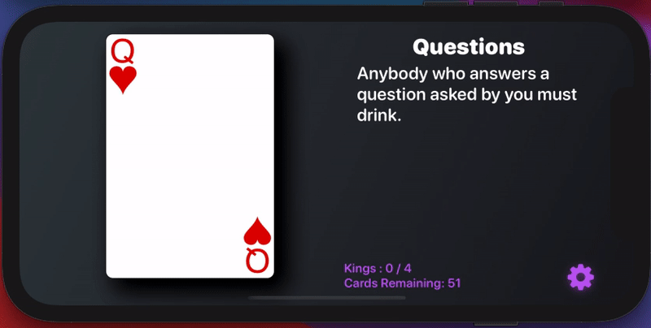
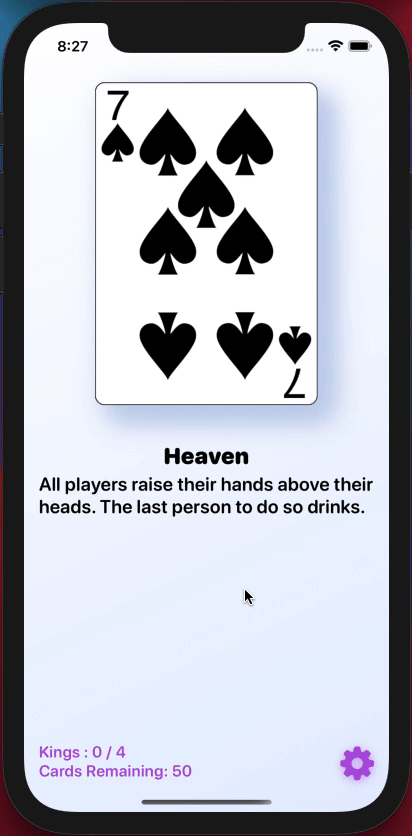
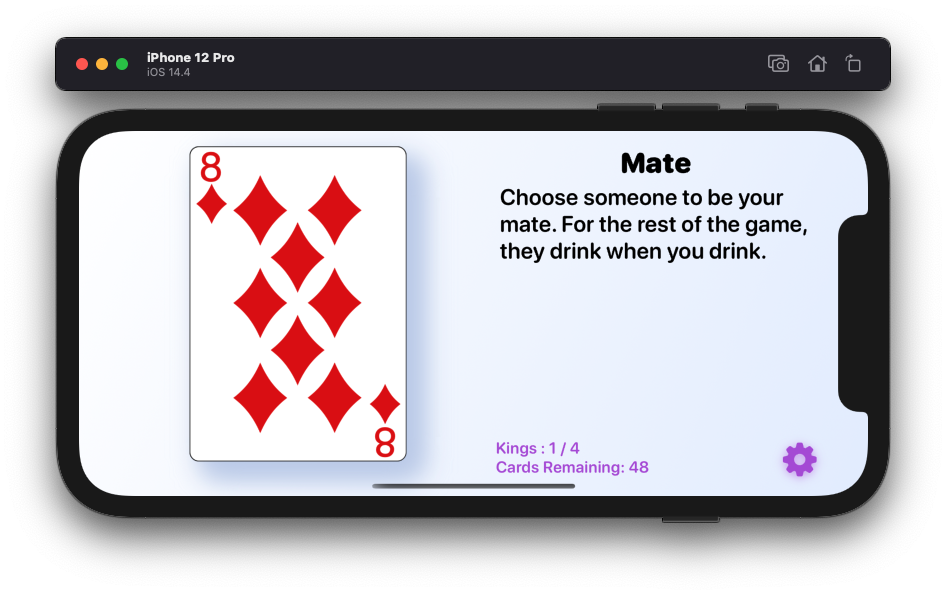
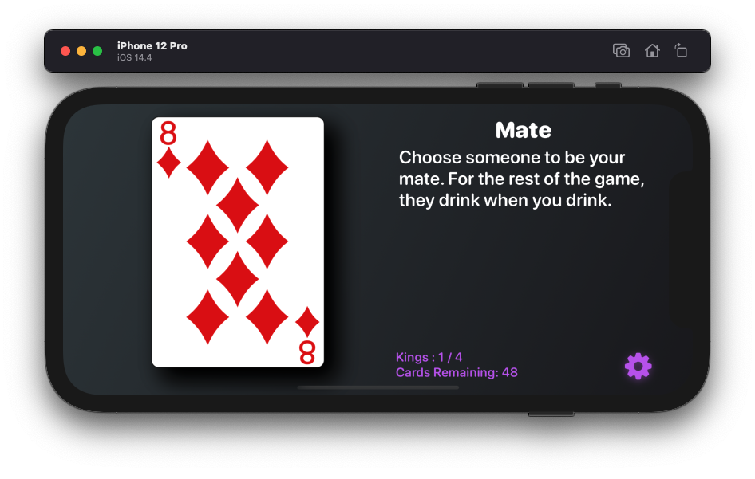
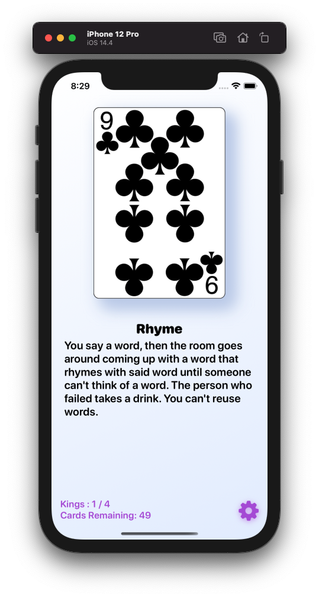
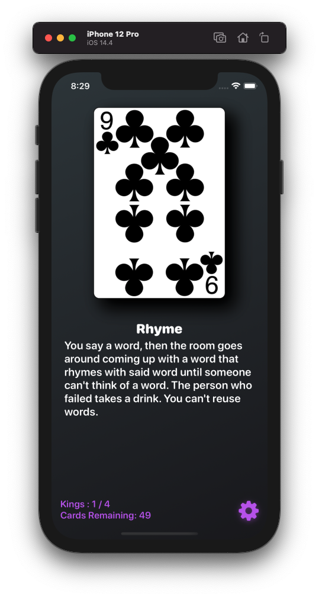

# King-s-Cup
Classic drinking game on iOS/iPadOS

|  |  |
| --- | --- |

| Swiping in Landscape | 
| --- |
 

## Technologies Used
* SwiftUI (https://developer.apple.com/documentation/swiftui)
* Combine (https://developer.apple.com/documentation/combine)

| Swiping in Portrait | Showing Used Cards |
| --- | --- |
|  |  |
| --- | --- |

| iPhone Light Mode (Landscape) | iPhone Dark Mode (Landscape) |
| --- | --- |
|  |  |

| iPhone Light Mode (Portrait) | iPhone Dark Mode (Portrait) |
| --- | --- |
|  |  |

## Todos
* Enable users to create custom rules 
* Persist custom rules
* Customize game mode
